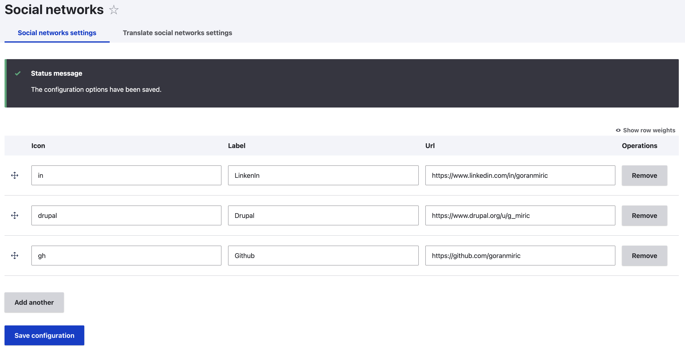

# Drupal 10 - Sortable config form with Add / Remove item

An example of how to create a form in Drupal 10+ with "Add Another" / "Remove Item" functionality.
Besides that form implements drag and drop functionality.
